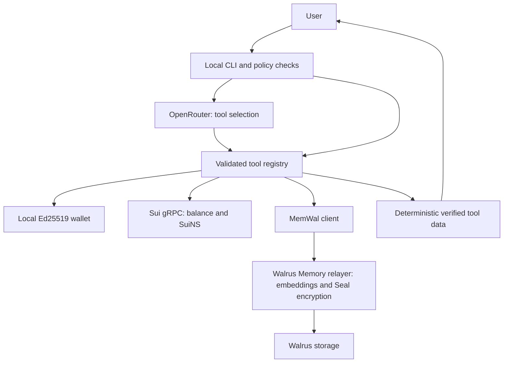

# Sui Local Agent

A local TypeScript agent with a real Sui wallet, on-chain SuiNS lookups, OpenRouter tool selection, and durable semantic memory through Walrus Memory. Testnet is the default. It runs off-chain; Sui supplies blockchain state.

**Current scope:** wallet creation and read operations, identity lookup, and remember/recall. No transfers, swaps, Move vault, enforced spending policy, or Nautilus deployment exists.



## Features

- Official `@mysten/sui` gRPC client; integer-safe MIST conversion.
- Wallet creation in application code, exclusive file creation, permission checks, no silent replacement.
- Forward SuiNS resolution and wallet default identity through the Sui client.
- Optional standard headless MemWal client, with confirmed persistence jobs and semantic recall.
- Local secret guard, explicit memory-write authorization, bounded iterative tool calls.
- Deterministic result rendering: generated prose is discarded, preventing model-written balances, addresses, or false storage confirmations.
- Lockfile, CI, secret scanning, weekly Dependabot PRs, optional official development tooling.

## Quick start

Require Git and Node **22.22.2 or newer**. The toolchain needs a newer Node 22 patch than the SDK alone. `.nvmrc` pins a tested Node 22 release.

```bash
git clone https://github.com/justbiar/suibasecamp.git
cd suibasecamp
nvm install
nvm use
./setup.sh
# Edit .env locally. Add your OpenRouter API key.
npm run agent
```

If you do not use nvm, install a supported Node LTS first. Setup installs locked npm dependencies, creates a private `.env` and `.data`, runs checks and build, and reports service health. It never asks for keys in terminal input. `npm start` runs the built application; `npm run dev` runs TypeScript directly.

Optional setup flags: `./setup.sh --with-sui --with-skills --with-walrus`. These download official tooling and may require network access. They are unnecessary for normal SDK operations. Setup without flags does not change system tools.

## Credentials and configuration

Run `npm run set-key` to fill in `.env` without an editor. It asks for the OpenRouter key and, optionally, the Walrus Memory account id and delegate key; press Enter to skip any of them. Secrets are read with the terminal echo off and never printed back, and it refuses to leave the Walrus pair half-set. Editing `.env` by hand does the same job.

Only `OPENROUTER_API_KEY` is required for AI tool selection. Without it, all local slash commands remain available. OpenRouter receives chat input and tool schemas/status; it does not receive the application wallet key or recalled memory text. Ordinary supported requests route locally and may not contact the model at all.

Persistent memory additionally needs **both** `MEMWAL_ACCOUNT_ID` and `MEMWAL_PRIVATE_KEY`. The latter is a registered **delegate** key, not your account owner's wallet key. Create credentials via the [official Walrus Memory account/delegate guide](https://docs.wal.app/walrus-memory/contract/delegate-key-management).

| Optional variable            | Default / purpose                                                        |
| ---------------------------- | ------------------------------------------------------------------------ |
| `OPENROUTER_MODEL`           | `openrouter/free`; choose an available model with tool support           |
| `SUI_NETWORK`                | `testnet`; explicit `mainnet` enables read-only Mainnet use              |
| `SUI_GRPC_URL`               | Matching official fullnode endpoint when omitted                         |
| `AGENT_SUINS_NAME`           | Empty; expected name, compared with on-chain default; never overrides it |
| `WALLET_FILE`                | `.data/agent-wallet.json`; keep custom paths outside version control     |
| `SHOW_PRIVATE_KEY_ON_CREATE` | `true`; one-time local display only in an interactive terminal           |
| `MEMWAL_RELAYER_URL`         | `https://relayer-staging.memory.walrus.xyz`                              |
| `MEMWAL_NAMESPACE`           | `local-sui-agent`; keep stable across restarts                           |
| `LOG_LEVEL`                  | `info`; `silent` hides tool-call announcements                           |
| `MAX_TOOL_ITERATIONS`        | `6`; maximum model tool rounds                                           |
| `REQUEST_TIMEOUT_MS`         | `30000`                                                                  |

See [.env.example](.env.example). A partial memory configuration fails validation with field names, never values. Sui tools do not otherwise depend on memory credentials. Mainnet requires explicit network configuration, matching endpoint and a separate wallet file; this release cannot send transactions on any network.

## CLI and tools

| Tool                       | Local command          | Purpose                                   |
| -------------------------- | ---------------------- | ----------------------------------------- |
| `create_wallet`            | `/wallet create`       | Create or reuse the local wallet          |
| `get_balance`              | `/balance`             | Read SUI balance from the network         |
| `resolve_suins`            | `/resolve example.sui` | Name to current target address            |
| `get_agent_suins_identity` | `/identity`            | Wallet to on-chain default name           |
| `remember`                 | `/remember FACT`       | Store explicitly supplied non-secret text |
| `recall`                   | `/recall QUESTION`     | Retrieve durable facts by meaning         |
| `doctor`                   | `/doctor`              | Safe health diagnostics                   |

Type `/help` or `/exit`. Natural-language commands such as “Create a Sui wallet”, “What is my balance?”, and “Remember that ...” work directly. Other requests use OpenRouter for iterative tool selection. The app is purpose-built for these tools; it does not display free-form model prose. Unsupported or unrecognized requests return no verified result rather than an invented answer. For ambiguous memory-write wording, use `/remember`.

Export a wallet key again with an explicit **local-only** command:

```bash
npm run agent -- wallet:export
```

It requires an interactive terminal, prints a strong warning, and bypasses the model. Never pipe it into another service. With redirected output, creation saves the key but does not print it. Protect terminal scrollback and backups.

For test tokens, use the [official Testnet faucet](https://faucet.sui.io/) and select Testnet. This release does not automate faucet requests.

## Example session

Illustrative values below are not live results or a required identity. Actual tool results are formatted JSON with success, source and network fields.

```text
You > Create a Sui wallet
Tool > create_wallet
Verified tool data > create_wallet
  address: 0x... (full generated address in the real CLI)

You > What is my balance?
Tool > get_balance
Verified tool data > get_balance
  network: testnet
  balanceSui: "0.689" (illustration only)

You > Who are you on SuiNS?
Tool > get_agent_suins_identity
  suinsName: "biaragent.sui" (prototype example only)

You > Remember that my maximum spending per transaction is 5 SUI.
Tool > remember
  success: true
  message: Memory persisted successfully.

You > /exit
[restart with npm run agent]
You > What is my maximum spending per transaction?
Tool > recall
  text: "my maximum spending per transaction is 5 SUI."
  distance: 0.2586 (illustrative semantic distance, not a percentage)
```

The remembered limit is a preference, **not on-chain spending enforcement**. No conversation history is persisted or reused as a substitute for recall.

## Identity and memory setup

Register a name on SuiNS Testnet, point it at the generated address, and set that address's default name. Setting `AGENT_SUINS_NAME` alone does not register or assign anything. No name yields `NOT_FOUND`, not a crash. See [SuiNS setup](docs/SUINS.md).

MemWal needs a funded/configured account and an authorized delegate. Set the staging relayer and your namespace, run `npm run doctor`, then follow the [restart smoke test](docs/WALRUS_MEMORY.md). Standard MemWal sends plaintext to the relayer, which handles embeddings and Seal encryption before Walrus storage. We have not implemented custom Seal cryptography. Storage has a funded epoch lifetime; persistence is not a promise of permanent storage.

## Development and updates

```bash
npm ci
npm run typecheck
npm run lint
npm run format:check
npm test
npm run build
npm run doctor
npm run deps:check
npm run skills:list
npm run skills:install
```

Unit tests mock services and need no credentials. `RUN_LIVE_TESTS=true npm run test:integration` enables Testnet reads and configured MemWal health. Memory-writing tests need the additional `RUN_MEMORY_WRITE_TESTS=true` flag and may consume storage credits. The manual restart test exercises separate processes. A separate GitHub workflow supports opt-in live reads/health; regular CI never uses secrets.

Dependencies were checked against the npm registry at creation and installed as exact versions with a committed lockfile. TypeScript 6.0.3 is used because current typescript-eslint does not support TypeScript 7. Weekly Dependabot PRs cover npm, Actions and the scanner Docker image. No automatic merging is configured. Major updates require review and passing tests. `npm run deps:update` is an explicit developer action; it may propose breaking upgrades and is never run at application startup.

Official Mysten skills are development instructions, not runtime tools or part of the LLM system prompt. Their installer can fall back to a source cache without breaking runtime setup.

## Security, troubleshooting, roadmap

Read [SECURITY.md](SECURITY.md), [architecture](docs/ARCHITECTURE.md), [troubleshooting](docs/TROUBLESHOOTING.md), and [API verification notes](docs/API_VERIFICATION.md).

Future work: explicit transaction authorization, Move-enforced spending policies, swaps and reputation research. **Nautilus is NOT IMPLEMENTED YET**: see [future design](docs/NAUTILUS_FUTURE.md). No AWS account, Rust, Docker, enclave, or attestation is needed for the agent. Docker is used only for the optional CI secret scanner.
