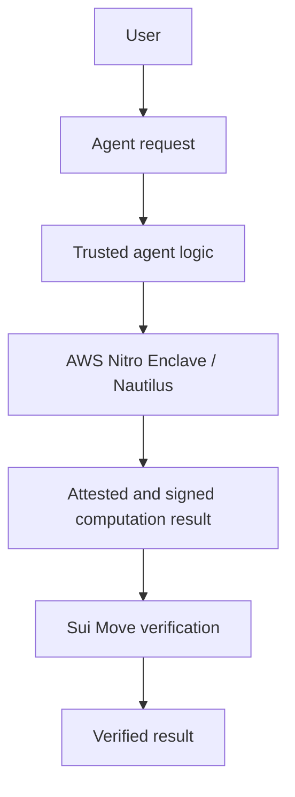

# Nautilus: NOT IMPLEMENTED YET

The current path is user -> local agent -> validated tools -> Sui / SuiNS / Walrus. No AWS resources, enclaves, attestations, PCR registrations, Rust crates or Move contracts are deployed or required.

A future path could be:

The question is whether a result was produced by expected code inside a trusted execution environment. Nautilus combines confidential off-chain computation with TEE attestation and signed results that Sui logic can verify. It does not make an LLM's reasoning true, turn untrusted external input into truth, or enforce a spending preference automatically.

A deployment would need a separate design and likely Rust/Cargo, Docker, Sui CLI, an AWS account, a Nitro-compatible EC2 instance, enclave image builds, PCR values, attestation verification, enclave public-key registration, and Move-side signature/payload verification. It must define code upgrades, replay protection, input provenance and key rotation.

Nitro Enclaves has no separate enclave fee, but its parent EC2 instance and associated AWS resources incur costs. Nothing in basic setup requests AWS credentials or provisions infrastructure.

References: [official Nautilus overview](https://www.sui.io/nautilus), [Mysten deployment guide](https://github.com/MystenLabs/nautilus/blob/main/UsingNautilus.md), [AWS Nitro Enclaves pricing](https://aws.amazon.com/ec2/nitro/nitro-enclaves/).
